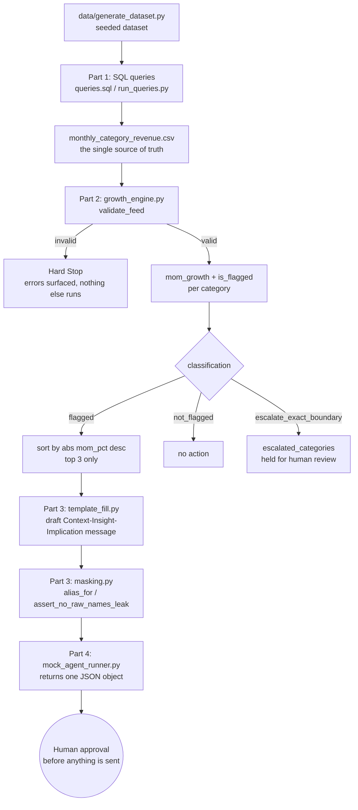

# Meesho Reseller Growth & Alert Intelligence Pipeline

A small, working, end-to-end reseller growth-monitoring pipeline for
Meesho: a SQL layer that answers standing business questions, a Python
engine that turns "significant change" into a numeric, validated rule, a
deterministic AI-narrative layer that turns verified numbers into
stakeholder-ready updates without ever inventing a figure, and an agent
specification plus a working mock runner that ties all three together
into one repeatable, guarded, human-reviewed monthly workflow.

## Zero API keys required

This entire pipeline runs with **no API keys, no paid services, and no
account-gated dependencies of any kind.** Part 3's "AI narrative" step is
a deterministic, fully offline template-fill function — no real LLM call
is made or required anywhere in this project.

## Pipeline flow



No box past "Hard Stop" or "no action" ever runs for that category — an
invalid feed stops the whole pipeline, and an unflagged category is
simply left alone.

## How to run everything, in order

### 1. Generate the dataset (Part 1 prerequisite)

```bash
python3 data/generate_dataset.py
```

Expected output:
```
Wrote 24 resellers and 900 orders. Zero-order reseller: RS024
```

### 2. Run Part 1's SQL queries

```bash
python3 part1_sql/run_queries.py
```

Writes all 6 CSVs into `part1_sql/output/`, including
`monthly_category_revenue.csv` — the file every later Part depends on.
Check the printed numbers against the brief's exact figures (e.g. April
Ethnic Wear = 104520.77, grand total = 1262066.92) before moving on.

### 3. Copy the validated feed into Part 2's fixtures

```bash
# macOS/Linux
cp part1_sql/output/monthly_category_revenue.csv part2_engine/fixtures/monthly_category_revenue.csv
# Windows PowerShell
Copy-Item part1_sql\output\monthly_category_revenue.csv part2_engine\fixtures\monthly_category_revenue.csv
```

### 4. Run Part 2's tests

```bash
cd part2_engine
python3 test_growth_engine.py
cd ..
```

Expected output:
```
PASSED: test_case_1_april_to_may_ethnic_wear_flagged
PASSED: test_case_2_may_to_june_beauty_not_flagged
PASSED: test_case_3_exact_boundary_escalates
PASSED: test_case_4_corrupted_feed_validation
PASSED: test_clean_feed_passes_validation

All tests passed.
```

**Optional quick check** — a faster, non-assertion sanity peek at the
same three functions (run from inside `part2_engine/`):
```bash
python3 quick_check.py
```

### 5. Run Part 3's masking sanity checks

```bash
cd part3_narrative
python3 masking.py
cd ..
```

Expected output ends with:
```
assert_no_raw_names_leak(final_narrative, raw_names) == True  [PASS]
assert_no_raw_names_leak(leaking_narrative, raw_names) == False [PASS]
```

### 6. Split Part 1's output into per-month feeds for Part 4

```bash
cd part4_agent
python3 split_months.py
cd ..
```

Writes `april_revenue.csv`, `may_revenue.csv`, and `june_revenue.csv`
directly into `part4_agent/`.

### 7. Run Part 4's mock agent runner

```bash
cd part4_agent
python3 mock_agent_runner.py
cd ..
```

Prints one JSON object per scenario: April→May (3 drafted, 2 suppressed),
May→June (3 drafted, 1 suppressed), and the corrupted-feed hard stop
(`"action_taken": "hard_stop"`).

### 8. Run Part 4's scenario assertions

```bash
cd part4_agent
python3 test_scenarios.py
cd ..
```

Expected output:
```
PASSED: test_april_to_may_drafts_top_3_in_order
PASSED: test_may_to_june_drafts_top_3_in_order
PASSED: test_corrupted_feed_hard_stops
PASSED: test_exact_boundary_is_escalated_not_flagged_or_suppressed

All scenario tests passed.
```

## How each Part maps to a workflow pattern

- **Part 1 (SQL)** mirrors the "compute real numbers first" step: nothing
  downstream is allowed to guess a number that SQL can answer directly
  from the raw orders/resellers tables.
- **Part 1 → Part 2** mirrors a "compute real numbers via SQL first, then
  hand off" order of operations: Part 2 never recomputes revenue itself,
  it only classifies percentages that Part 1's
  `monthly_category_revenue.csv` already contains.
- **Part 2** is the Input guardrail layer: `validate_feed` is what every
  later step depends on, and `is_flagged`'s three-way return value
  (flagged / not_flagged / escalate_exact_boundary) turns a vague
  "significant change" into an explicit, testable rule that refuses to
  silently pick a side on boundary cases.
- **Part 3** is the Output guardrail layer: the template-fill function can
  only echo back placeholder values that came from Part 1/Part 2, and
  `masking.py` prevents any raw reseller name from reaching an
  external-facing narrative.
- **Part 4** mirrors an **Intake → Summary → Report Draft → Validate**
  reporting flow (checked back to a real, computed value — checked before
  anything is considered ready for human review).

## Project structure

This is a visual map of every folder, so you can see at a glance whether
everything landed in the right place. You should see:

```
Meesho_reseller/
├── README.md
├── data/
├── part1_sql/
│   └── output/
├── part2_engine/
│   └── fixtures/
├── part3_narrative/
└── part4_agent/
```

**Status: done when your folder tree matches what you see above.**

## Documentation referenced

Only the official Python standard-library docs (`csv`, `sqlite3`, `json`,
`random`) were consulted while implementing this project.